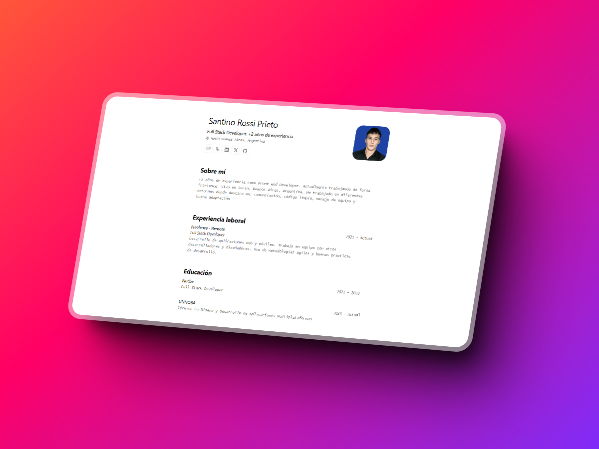

<div align="center">

 
<h2>
    <em>CV-Porfolio</em> minimalista maquetado para web y pdf
</h2>
<p>
Esquema del JSON de CV de <a href="https://jsonresume.org/schema/">jsonresume.org</a>
</p>


<p>
Basado en el diseño de <a href="https://github.com/BartoszJarocki/cv">Bartosz Jarocki</a>

</p>

</div>


## 🛠️ Stack

- [**Astro**](https://astro.build/) - El framework web de la nueva época.
- [**Typescript**](https://www.typescriptlang.org/) - JavaScript con sintaxis de tipado.
- [**Ninja Keys**](https://github.com/ssleptsov/ninja-keys) - Menu desplegable con atajos de teclado hecho en puro Javascript.


## 🚀 Empezar

### 1. Usa este [repo](https://github.com/midudev/minimalist-portfolio-json) como _template_ de un proyecto de Astro


- Yo uso [pnpm](https://pnpm.io/installation) como gestor de dependencias y empaquetador.

```bash
# Activa pnpm en MacOS, WSL & Linux:
corepack enable
corepack prepare pnpm@latest --activate
```


## 🧞 Comandos

|     | Comando          | Acción                                        |
| :-- | :--------------- | :-------------------------------------------- |
| ⚙️  | `dev` o `start` | Lanza un servidor de desarrollo local en  `localhost:4321`.  |
| ⚙️  | `build`          | Comprueba posibles errores y hace un empaquetado de producción en `./dist/`.      |
| ⚙️  | `preview`        | Vista previa en local `localhost:4321` |

### 📌 Vista previa de la portada:
</img>


### Basado en MIDUDEV ❤️:
https://www.youtube.com/watch?v=Zwh92LTB-Bk&t=418s


